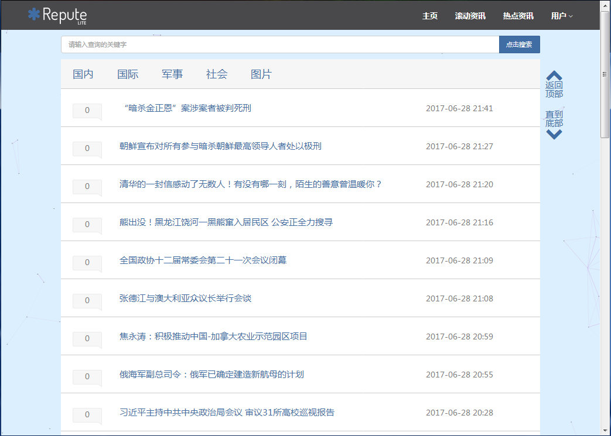
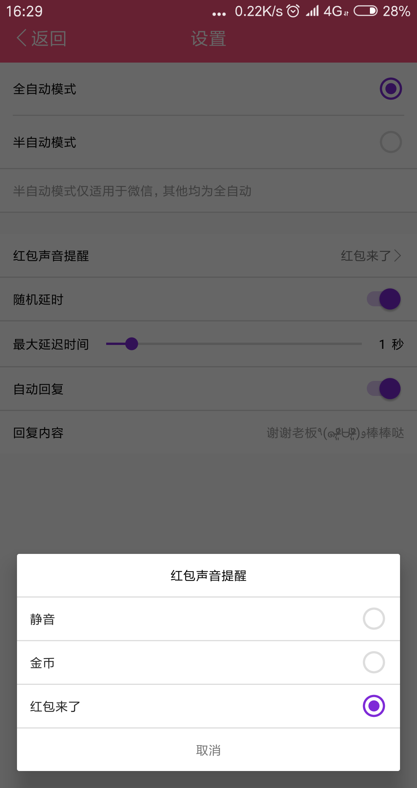
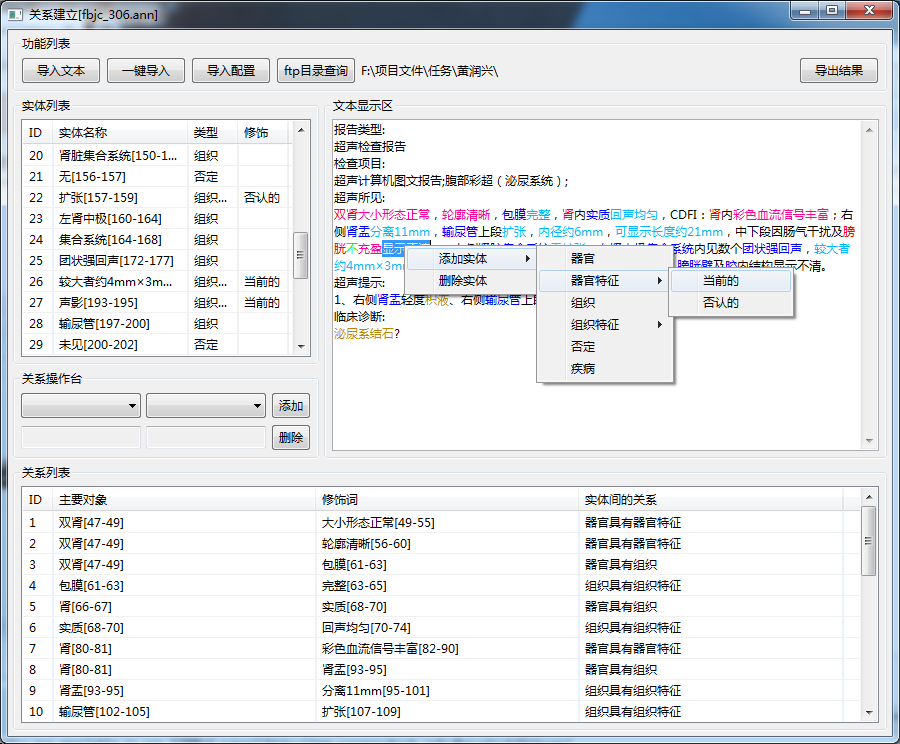
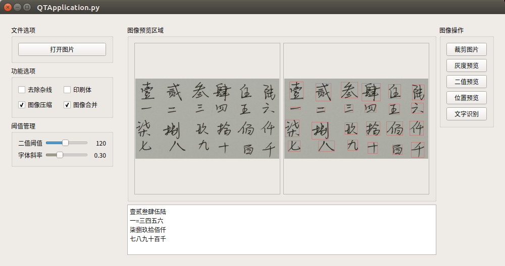
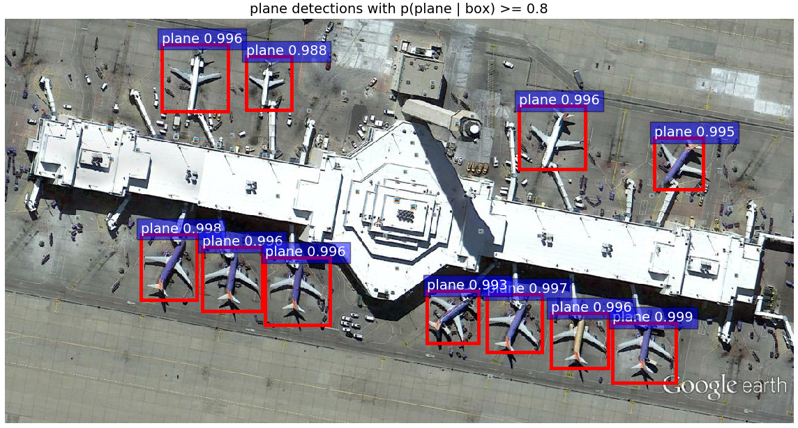

# 网站开发篇
## 作业在线评测系统

## 新闻评论系统
- 开发所用系统
> Windows

- 技术/框架应用
> SQL Server/JavaBean/FontAwesome/Bootstrap

- 涉及编程语言
> Java/SQL/Python/HTML/CSS/JS

- 开发周期
> 15天

- 项目开发内容
> - 通过Python爬虫，定时爬取QQ新闻和新浪新闻的最新新闻摘要，并存储到数据库中
> - 利用JavaBean，把所有新闻摘要信息提前缓存至客户端，并以此实现分页功能
> - 通过输入关键词，可搜索关于新闻标题中的关键字以及新闻所属的小标签
> - 设计选项卡，让新闻可以根据类型进行分类显示
> - 制作自适应布局，可同时满足桌面端和手机端的内容展示

- 项目成果预览

# 安卓开发篇
## 红包巡警
- 开发所用系统
> Ubuntu 16.04 LTS

- 技术/框架应用
> Accseeibility Service/Gson/HttpURLConnection

- 涉及编程语言
> Java/PHP/XML

- 开发周期
> 30天

- 项目开发内容
> - 通过安卓自带的辅助功能，监控手机的动作（窗口切换、悬浮窗消息、内容变化）
> - 通过安卓自带的辅助功能，自动检索、打开、关闭红包节点（适配Android5.0-Android8.0）
> - 通过安卓自带的辅助功能，根据配置，选择性地自动播放红包提醒音频
> - 通过安卓自带的辅助功能，根据配置，选择性地自动回复设置内容
> - 服务器端以PHP进行开发，同时封装、查询、验证及提交订单的API
> - 用户通过向服务器发送请求，查询是否拥有有效权限使用应用
> - 用户通过向服务器发送请求，提交并查询充值订单，若充值成功，可以延长用户使用时间
> - 后台管理员可以增删改查所有充值订单
> - 用户可以手动检测最新版本并下载更新

- 项目成果预览

# 软件工具篇
## 文本属性及关系标注
- 开发所用系统
> Windows

- 技术/框架应用
> Window Builder

- 涉及编程语言
> Java

- 开发周期
> 7天

- 项目开发内容
> - 采用Window Builder开发程序的交互界面
> - 采用FTP协议和C/S结构实现在线标注的功能，便于实时提交任务
> - 可根据不同类型的文本，提前设置不同的配置文件并加载，可动态生成标注选项
> - 参考brat标注工具的输入输出文件，统一输入输出流格式
> - 添加快捷按键选项，实现快速文本标注

- 项目成果预览

## 学生成绩管理系统

# 机器学习篇
## 手写汉字识别
- 开发所用系统
> Ubuntu 16.04 LTS

- 技术/框架应用
> OpenCV/Caffe/Qt

- 涉及编程语言
> Python/Shell

- 开发周期
> 7天

- 项目开发内容
> - 设计针对汉字的神经网络，并收集手写汉字数据集，利用进行caffe进行训练
> - 以横向投影和纵向投影，初步找出汉字所在区域，并裁剪出有效区域
> - 根据日常书写习惯，分析字体斜率[1]，进一步分离和组合汉字[2]
>> [1]字体斜率：把一个汉字的上下左右用框框起来，对角线与水平线的倾斜程度  
>> [2]分离和组合：因为部首问题，一个字可能会被投影分割成若干部分，要对其进行组合；部分字体比较窄小，在进行裁剪之后，经过组合后可能跟其他汉字发生黏连，要对其进行分离
> - 结合Qt，简易化图像识别的操作，个性化功能选项，附带图像裁剪和预览，可及时修正参数配置
> - 加载Caffe训练好的神经网络模型，向pycaffe传入每一个汉字的图像，进行汉字识别

- 项目成果预览

## 遥感飞机图像识别
- 开发所用系统
> Ubuntu 16.04 LTS

- 技术/框架应用
> A-Fast-RCNN/Caffe/OpenCV

- 涉及编程语言
> Matlab/Python

- 开发周期
> 30天

- 项目开发内容
> - 采用Selective Search算法生成飞机图像训练集和测试集
> - 采用Selective Search算法生成场景图像训练集和测试集
> - 利用A-Fast-RCNN框架和VGG16模型进行训练，保存两种数据的模型
> - 分别导出两个模型的倒数第二个全连接层数据，进行迁移训练，提高图像识别的mAP

- 项目成果预览

